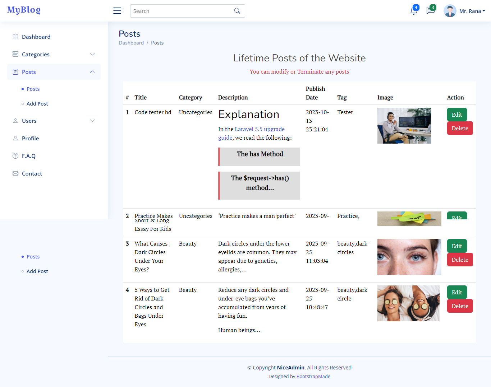
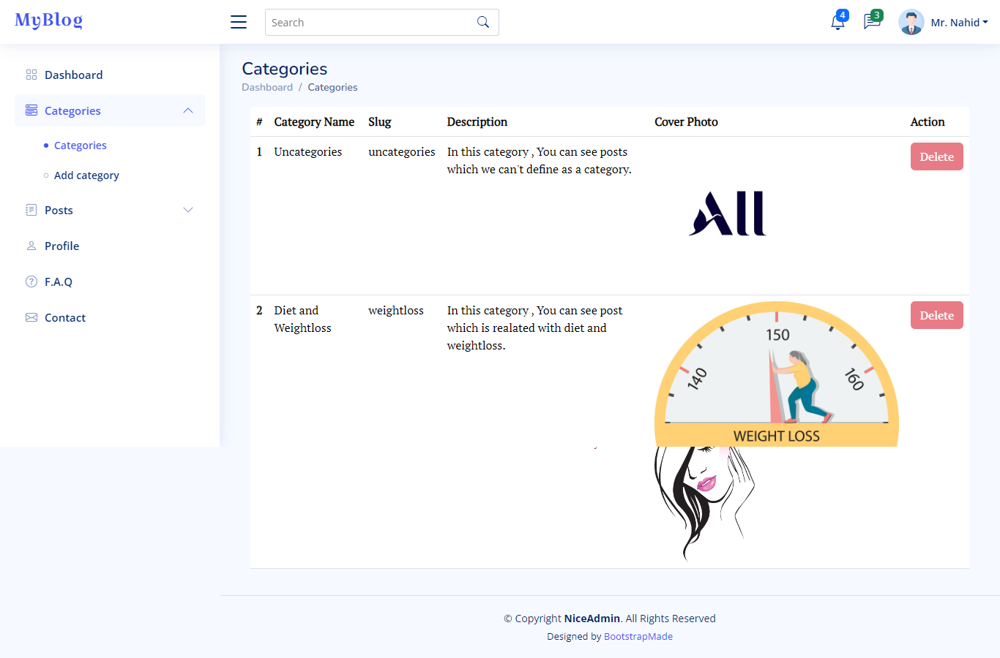
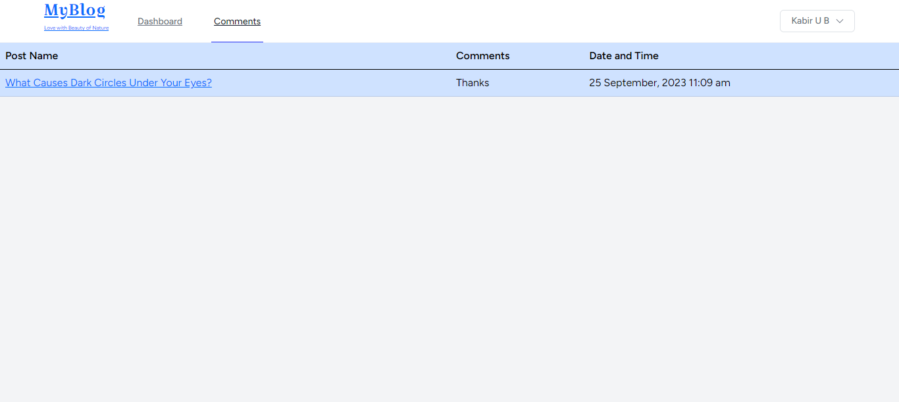

# blog_myblog
A laravel blog website used as a sample of my task

<a href="https://blog.rana.meranaint.com/">Live Preview of Blog Website</a>
  {Class "PDO" not found -----> Started working to fixed this}

 

<h3>Admin Panel</h3> 
 

 

<h3>Author Panel</h3>
  

 

<h3>User Panel</h3>
  

Thanks,  
Rana Bepari  
<a href="https://rana.meranaint.com/">https://rana.meranaint.com/</a>
