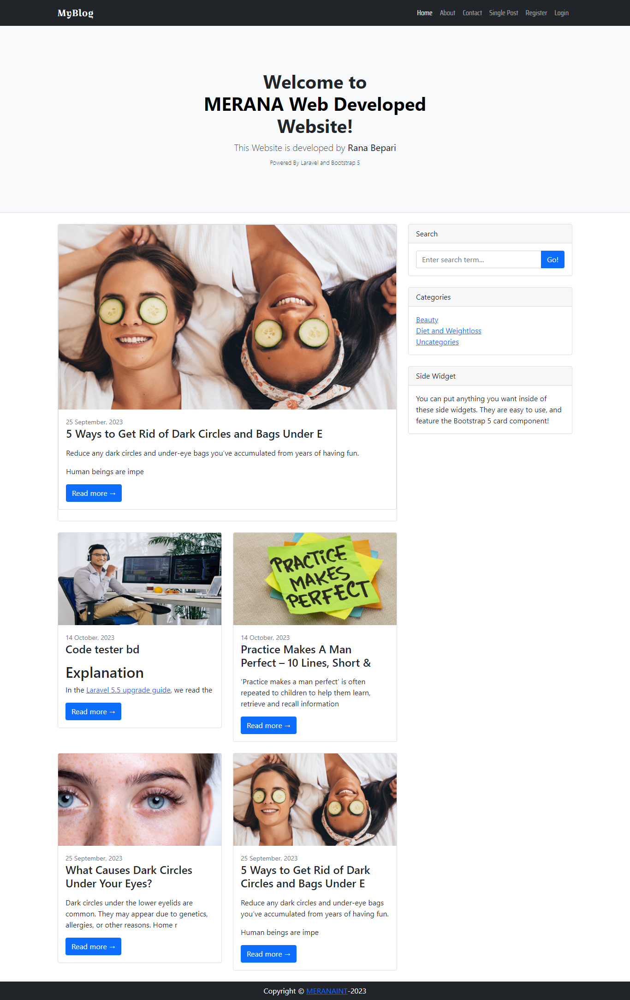

# blog_myblog
A laravel blog website used as a sample of my task   
<h3>Functionality</h3>
<li> Authentication -> Admin, Author, Visitor </li>
<li> Post Functionality (Categorywise) </li>
<li> Comment Functionality </li>
<li> Three Different Panel </li>
 
<h4>Short Description</h4>

 
<strong>Admin Panel</strong>  
-> Can Create, Update or Delete Categories --Any 
-> Can Create, Update or Delete Posts --Any  
-> Can Comment --any ***Author Sign on his Post  
 
<strong>Author Panel</strong>  
-> Can Create Categories --Any 
-> Can Create, Update or Delete Posts --Only him 
-> Can Comment --any ***Author Sign on his Post 
 
<strong>Visitor</strong> 
->Can Comment or Reply  
->Can see where he commented. 

<strong>Live Website : <a href="https://myblog-sample.rana.my.id/"> https://myblog-sample.rana.my.id/ </a></strong>
    

 

<h3>Admin Panel</h3> 
 
<strong> Login as Admin  </strong>  
Username : admin@test.me  
Password : adminx4312  

 

<h3>Author Panel</h3>
  
<strong> Login as Author  </strong>  
Username : author@test.me  
Password : authorx4312  

 

<h3>User Panel</h3>
  
<strong> Login as User  </strong>  
Username : user@test.me  
Password : userx4312  

Thanks,  
Rana Bepari  
<a href="https://ranasvc.com/"><strong>Official Website</strong></a>
